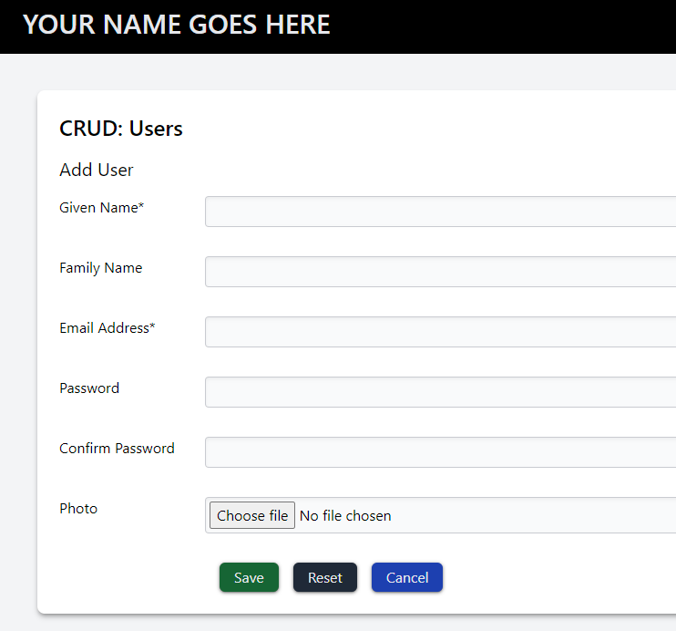

# HTML, PHP and Databases

## Set up Laragon

- Change "Root Folder" to your Source/Repos
- Start Laragon services (Apache & 'MySQL')
- Visit http://localhost/phpmyadmin to use PHPMyAdmin

## Database Setup

- Open the`Define User and DB SQL file` in the `database` folder.
- Replace all instances of INITIALS with YOUR initials.
- Using either PhpMyAdmin or another MySQL IDE, run the SQL to remove the
  previous database if it exists, remove the previous user and permissions if
  they exist, then create the new database, new user and grant the
  permissions.
- Open the `Define and Seed Users Table SQL` file that is in the `database`
  folder.
- Replace all instances of INITIALS with YOUR initials.
- Using your preferred MySQL IDE, execute the SQL commands to create the
  `users` table and seed the table with the initial users.

## Retrieve

The Retrieve page is provided as is. It will show all the users from the
database.

Open the code in PhpStorm, and preview it in the browser.

You should see:


### Exercise

- Create a new file called `database.php`.
- From this retrieve file, move the lines below into the new file:

```php 
// Define database configuration
define('DB_TYPE', 'mysql');
const DB_HOST = '127.0.0.1';
const DB_PORT = 3306;
const DB_NAME = 'INITIALS_saas_fed';
const DB_USER = 'INITIALS_saas_fed';
const DB_PASS = 'Password1';

// Create database connection (Database Source Name)
$dsn = DB_TYPE.':host='.DB_HOST.';port='.DB_PORT.
    ";dbname=".DB_NAME.';charset=utf8;';

try {
    $pdo = new PDO($dsn, DB_USER, DB_PASS);
    // Error mode will be exception based
    $pdo->setAttribute(PDO::ATTR_ERRMODE, PDO::ERRMODE_EXCEPTION);
    // Retrieve data as associative array
    $pdo->setAttribute(PDO::ATTR_DEFAULT_FETCH_MODE, PDO::FETCH_ASSOC);
    $message = "Connected to DB";
} catch (PDOException $error) {
    echo "<h2>ERROR</h2>";
    echo "<p>Database Connection Issue: {$error->getMessage()}</p>";
    die();
}
```

- In the retrieve file, just below the `$title` variable declaration add:

```php
include_once 'database.php';
```

- Refresh the preview and make sure that the data is still retrieved as
  previously seen.

### Exercise

- Still in the retrieve page, we are going to wrap the message block in a
  decision so that the message shows only if the variable is set.
- Before the `<section class="bg-green-200 ...">` add:

```php
    <?php
    if (isset($message)) {
        ?>
```

- After the `</section>` add:

```php
        <?php
    } // end if
    ?>
```

- Refresh the preview and make sure it still works as expected.

## Create

For the create page, duplicate the `retrieve.php` and rename it `create.php`.

#### Remove the unwanted retrieve code

Edit the file and remove the code between:

```html

<section>
    <header class="pb-4">
        <h3 class="text-xl">Users</h3>
    </header>
```     

and

```html          
            </div>
</section>
```

You will complete the remaining fields using the data provided after we
show you how to create the form and first field.

#### Add Form Element

Remove the `<div class="flex flex-wrap gap-8">` and replacve it with the form
element by entering:

form[action=create.php,method=post].flex.flex-col.gap-8

and pressing `TAB`.

This should add:

```html

<form class="flex flex-col gap-8" action="create.php" method="post"></form>
```

Press enter three times to create a blank line between the open and close
tags of the form element.

Now remove the following `</div>` as it is no longer needed.

#### Create Given Name Field

Add the code for the Given Name field by entering:

```html

<div class="flex flex-row">
    <label for="given" class="w-40">Given Name*</label>
    <input type="text" name="given_name" id="given"
           class="grow bg-gray-50 p-1 border border-gray-700/25 rounded shadow-inner">
</div>
```

You will repeat this block for each of the remaining fields, but making
sure that the element, name, id, for, and type are correct.

| name        | for/id           | element | type     |
|-------------|------------------|---------|----------|
| given_name  | given            | input   | text     |
| family_name | family           | input   | text     |
| email       | email            | input   | email    |
| password    | password         | input   | password |
| confirm     | confirm_password | input   | password |
| photo       | photograph       | input   | file     |

The final block is for Save, Reset and Cancel buttons:

```html

<div class="flex flex-row gap-4">
  <label class="w-40"></label>
  <button type="submit"
          class="px-4 py-1 bg-green-800 text-gray-200 
                shadow shadow-black/50 rounded-md 
                hover:bg-green-300 hover:text-gray-800 hover:shadow-none 
                transition duration-500 ">
    Save
  </button>
  <button type="reset"
          class="px-4 py-1 bg-gray-800 text-gray-200 
            shadow shadow-black/50 rounded-md 
            hover:bg-gray-300 hover:text-gray-800 hover:shadow-none 
            transition duration-500 ">
    Reset
  </button>
  <a href=""
     class="px-4 py-1 bg-blue-800 text-gray-200 
       shadow shadow-black/50 rounded-md 
       hover:bg-blue-300 hover:text-gray-800 hover:shadow-none 
       transition duration-500 ">Cancel</a>
</div>
```

Check the page is displayed similar to this:




#### Question

How does the above code make the buttons animate?

#### Insert a User

We now need to create the code to actually insert the user.

Immediately after the `include_once 'database.php';` line we now add a 
blank line then:

```php
if ($_SERVER['REQUEST_METHOD'] == 'POST' && isset($_POST['save'])) {


}
```
Inside this `if` we now start by retrieving the given name and the email 
from the submitted form. We pass the given name through the 
`htmlspecialchars` function to convert characters like `<` into `&lt` etc.

```php
    $givenName = htmlspecialchars($_POST['given_name']);
    $email = $_POST['email'];
```

The email needs a bit more specialist attention. More on that later.

After this we create the SQL statement in a form that contains 
placeholders. We use `:` followed by the placeholder text for this.

```php
    $sql = "INSERT INTO users(given_name, email)"
        ." VALUES (:given, :mail)";
```

When we do this, it means we can then use a prepared statement and fill in 
the placeholders with the real data when executing the query.

```php
    $statement = $pdo->prepare($sql);

    $parameters = [
        "given" => $givenName,
        "mail" => $email,
    ];
    
    $statement->execute($parameters);
```
After executing the query we redirect the page back to the index (for 
example).

```php
    header('Location: index.php');
    exit;
```

### Exercise:

Using your newly created Create page, you are to test it using the new
users provided below.

| Given Name | Family Name | Email Address             | Password  | Image to Use |
|------------|-------------|---------------------------|-----------|--------------|
| Anne T.    | Sosial      | Anne.T.Social@example.com | Password1 | Anne.png     |
| Dwayne     | Pipe        | Dwayne.Pipe@example.com   | Password1 | Dwayne.png   |
| Carrie     | Oakie       | Carrie.Oakie@example.com  | Password1 | Carrie.png   |
| Count      | Orff        | Count.Orff@example.com    | Password1 | Count.png    |
| Chuck      | Roast       | Chuck.Roast@example.com   | Password1 |              |
| Doug       | Hole        | Doug.Whole@example.com    | Password1 | Doug.png     |
| Drew Annie | Blank       | Drew.A.Blanc@example.com  | Password1 | Drew.png     |
| Dusty      | Carr        | Dusty.Carr@example.com    | Password1 |              |
| Hazle      | Nutt        | Hazle.Nutt@example.com    | Password1 |              |
| Dee        | Leet        | Dee.Leet@example.com      | DeleteMe  | Avatar.png   |


## Delete Users

The delete page should contain the details of the user that will be 
deleted and a "Delete" or "Cancel" button. The former deletes the record, 
teh latter aborts the operation and redirects to the index page.

### Exercise

The following user should be deleted using the delete page.

| Given Name | Family Name | Email Address        | Password | Image to Use |
|------------|-------------|----------------------|----------|--------------|
| Dee        | Leet        | Dee.Leet@example.com | DeleteMe | Avatar.png   |


## Edit Users

...


### Exercise
The following users have issues, and should be edited using the edit page.

Correct names, email addresses and images as needed.

| Given Name  | Family Name | Email Address             | Password  | Image to Use  |
|-------------|-------------|---------------------------|-----------|---------------|
| Anne T.     | **Social**  | Anne.T.Social@example.com | Password1 | Anne.png      |
| Chuck       | Roast       | Chuck.Roast@example.com   | Password1 | **Chuck.png** |
| Doug        | Hole        | **Doug.Hole@example.com** | Password1 | Doug.png      |
| **Drew A.** | **Blanc**   | Drew.A.Blanc@example.com  | Password1 | Drew.png      |
| Dusty       | Carr        | Dusty.Carr@example.com    | Password1 | **Dusty.png** |
| **Hazel**   | Nutt        | Hazle.Nutt@example.com    | Password1 | **Hazel.png** |


## Retrieve / Search

...
